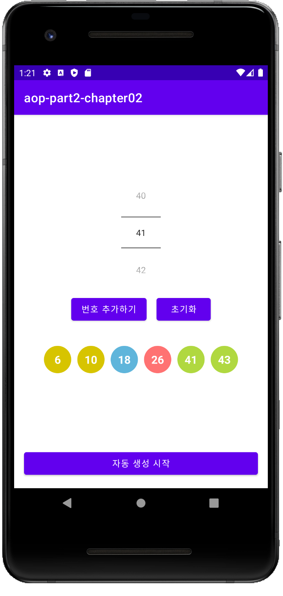

# Lotto

## 이 챕터를 통해 배운 것

  - **ConstraintLayout** 사용하기
  - **NumberPicker** 의 속성들과 사용하는 법
- Shape Drawable 사용하기 
  - (https://developer.android.com/guide/topics/resources/drawable-resource#Shape)

## Kotlin 문법

apply

When

Random

Collection

​	- Set, List

람다함수

# 결과화면

### 로또 번호 추첨기

0~5개까지 수동 선택 가능하도록 구현하기

수동선택한 번호를 제외한 나머지 번호는 랜덤으로 표시하기

